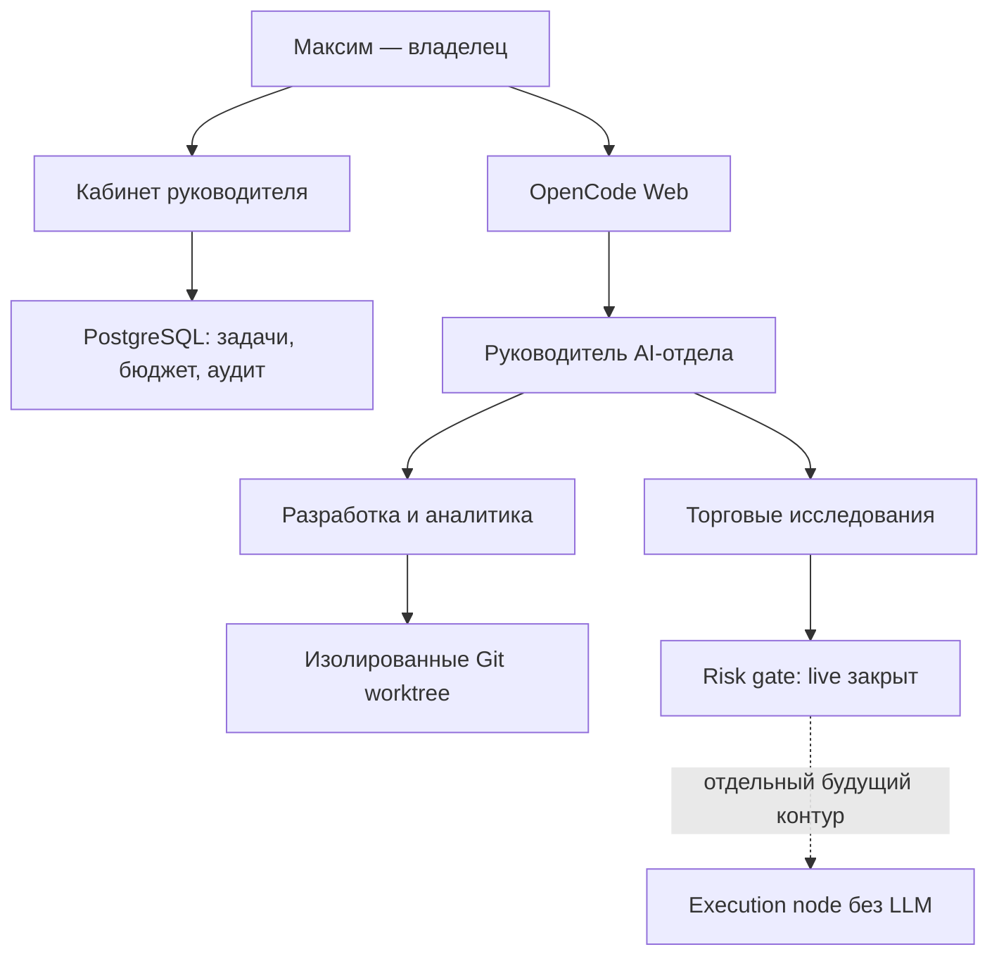

# AI Orchestra — виртуальный отдел разработки, аналитики и торговых исследований

AI Orchestra превращает один интерфейс в управляемую AI-команду: руководитель принимает задачу, распределяет работу между профильными ролями, контролирует проверки и показывает владельцу состояние отдела в отдельном кабинете.

На старте модели работают через общий ключ AITunnel. Позже весь контур переключается на отдельные ключи OpenAI, Anthropic и Google одной командой — без переноса репозиториев, истории и правил.

> Статус: пилот 0.2. Код, аналитика, backtest и paper-trading разрешены. `git push`, merge, production deploy и реальные торговые операции остаются за отдельным подтвержденным процессом.

## Что уже предусмотрено

- OpenCode Web для работы с виртуальным отделом;
- отдельный веб-кабинет руководителя;
- задачи с контролируемыми переходами статуса;
- согласования, журнал действий и учет расходов моделей;
- PostgreSQL для состояния кабинета;
- общий ключ AITunnel или раздельные ключи провайдеров;
- изолированные Git worktree: одна задача — одна ветка — один агент-редактор;
- резервное копирование БД, истории OpenCode, конфигурации и Git-репозиториев;
- профильные роли для крипты и стандартных активов;
- fail-closed торговый предохранитель: live-ордера отключены и не могут быть включены из кабинета.

## Интерфейсы

| Интерфейс | Назначение | Локальный адрес по умолчанию |
| --- | --- | --- |
| Кабинет руководителя | задачи, согласования, бюджеты, аудит, торговые ограничения | `http://127.0.0.1:8088` |
| OpenCode Web | постановка задач AI-руководителю и работа с репозиториями | `http://127.0.0.1:4096` |

Оба адреса защищены отдельными Basic Auth учетными данными и публикуются только на `127.0.0.1`. Для внешнего доступа нужен Nginx с HTTPS либо защищенный VPN.

## Архитектура



Контейнер OpenCode не получает Docker socket хоста. Он не может самостоятельно управлять production-контейнерами. Кабинет также не содержит функций deploy или отправки ордеров.

## Роли отдела

### Разработка и аналитика

| Роль | Зона ответственности | Доступ |
| --- | --- | --- |
| `department-lead` | прием задачи, декомпозиция, делегирование и итог | управление агентами, без редактирования |
| `business-analyst` | требования и критерии приемки | чтение |
| `architect` | архитектура, API, БД, миграции и откат | чтение |
| `developer` | реализация и локальные проверки | редактирование, безопасные команды |
| `qa-engineer` | тесты и воспроизводимые дефекты | чтение и запуск проверок |
| `code-reviewer` | независимое ревью diff | чтение |
| `devops-engineer` | Docker, CI/CD и runbook | редактирование, без production deploy |
| `data-analyst` | SQL, качество данных и метрики | ограниченные вычисления |

### Крипта и стандартные активы

| Роль | Зона ответственности | Жесткое ограничение |
| --- | --- | --- |
| `quant-researcher` | гипотезы, backtest, costs, bias, tail-risk | без ордеров и ключей |
| `market-data-engineer` | ingestion, instrument master, качество и свежесть данных | только read-only/sandbox источники |
| `portfolio-analyst` | P&L, экспозиции, концентрация и сценарии | без исполнения |
| `risk-officer` | лимиты, fail-safe проверки и независимое вето | не может включать торговлю |
| `execution-engineer` | код адаптеров, idempotency и reconciliation | mocks/sandbox, сетевые order-вызовы запрещены |
| `trade-reviewer` | независимая проверка исследования, риска и исполнения | только чтение |

## Режимы ключей моделей

### `shared` — временный общий ключ AITunnel

- один `AITUNNEL_API_KEY`;
- модели разных производителей доступны через OpenAI-совместимый endpoint;
- подходит для пилота и сравнения моделей;
- для ключа нужно задать бюджет, срок действия, разрешенные модели и IP сервера.

### `separate` — прямые ключи

- `OPENAI_API_KEY` — архитектура и coding-задачи;
- `ANTHROPIC_API_KEY` — руководитель, risk и review;
- `GOOGLE_GENERATIVE_AI_API_KEY` — бизнес-, data- и portfolio-аналитика.

Переключение выполняется атомарно:

```bash
make shared
make separate
```

Пересоздается только OpenCode. Репозитории, кабинет, PostgreSQL и история сессий не затрагиваются.

## Требования к серверу

Для пилота:

- Ubuntu 22.04 или 24.04;
- 4 vCPU;
- 8 ГБ RAM;
- 40–60 ГБ диска плюс место под рабочие репозитории и backup;
- Docker Engine и Docker Compose v2;
- Nginx и TLS для внешнего доступа.

GPU не нужен: модели работают во внешних API. До развертывания проверьте порты `4096` и `8088`, запас RAM/CPU и отсутствие пересечений с действующими сервисами. Этот compose не публикует PostgreSQL наружу и не использует порты существующего Auto-trader.

## Быстрый запуск

```bash
cd /opt
git clone https://github.com/m9117882424/ai_orchestra.git
cd ai_orchestra

make init
nano .env
```

Для первого запуска заполните только маршрут моделей:

```dotenv
KEY_MODE=shared
AITUNNEL_API_KEY=sk-aitunnel-...
```

`make init` отдельно генерирует пароли OpenCode, кабинета руководителя и PostgreSQL. Не публикуйте `.env` и не отправляйте его в чат.

Проверка и запуск:

```bash
make shared
make preflight
make build
make up
make status
make smoke
```

Логи:

```bash
make logs
make manager-logs
```

Для браузерного доступа настройте два домена по примеру `deploy/nginx-ai-department.conf.example`. Если домены отличаются от примера, также задайте корректный `OPENCODE_PUBLIC_URL` в `.env`.

## Работа через кабинет руководителя

Кабинет показывает:

- количество задач в работе и завершенных;
- запросы на согласование;
- расходы моделей за текущий месяц;
- лимиты `department` и `trading-research`;
- журнал изменения задач, решений и бюджетов;
- состояние торгового предохранителя.

Пока интеграция usage с провайдерами не подключена, расходы передаются в кабинет через API, а лимиты являются контрольной политикой. Фактический hard stop обязательно настройте также в AITunnel или кабинете прямого провайдера.

Поддерживаемые статусы задачи:

```text
backlog → planned → in_progress → waiting_approval → qa → done
                              ↘ failed ↗
```

Переходы проверяются на сервере. Завершенную задачу нельзя случайно вернуть в работу через UI.

Типы согласований:

- изменение кода;
- `git push`;
- развертывание;
- изменение режима торговли;
- реальный ордер.

Важно: согласование — запись управленческого решения, а не исполнительная команда. Даже статус `approved` для `live_order` не меняет торговый предохранитель и никуда не отправляет заявку.

Кабинет использует JSON API под тем же Basic Auth. Изменяющие запросы дополнительно требуют заголовок:

```http
X-Control-Request: ai-orchestra
```

Это защищает пилотный интерфейс от простых cross-site запросов. Для production-уровня следующим этапом нужны SSO/OIDC, роли пользователей и миграции Alembic.

## Добавление рабочего проекта

Проекты находятся в `repos/`, внутри OpenCode — `/workspace/repos/projects`.

```bash
cd /opt/ai_orchestra/repos
git clone https://github.com/m9117882424/arvento-kpp-report.git
```

Для приватного репозитория используйте deploy key или fine-grained GitHub token только с необходимыми правами. Не вставляйте токен в URL, попадающий в историю shell.

### Изолированный worktree задачи

```bash
./scripts/worktree-create.sh arvento-kpp-report fix-mileage origin/main
```

Будут созданы:

- ветка `agent/fix-mileage`;
- каталог `worktrees/arvento-kpp-report/fix-mileage`;
- путь внутри OpenCode `/workspace/worktrees/arvento-kpp-report/fix-mileage`.

Один worktree назначается только одному агенту-редактору. Аналитики и reviewer могут читать тот же diff, но не изменять его.

После коммита и проверки чистоты:

```bash
./scripts/worktree-remove.sh arvento-kpp-report fix-mileage --yes
```

Скрипт откажется удалять worktree с незакоммиченными файлами и сохранит ветку.

## Рекомендуемый рабочий цикл

1. Создать задачу в кабинете.
2. Создать для нее worktree.
3. В OpenCode выбрать `department-lead` и передать задачу с путем проекта.
4. Руководитель привлекает аналитика/архитектора, затем одного агента-редактора.
5. QA и reviewer независимо проверяют фактический diff.
6. При необходимости создать запрос согласования в кабинете.
7. Владелец вручную решает, публиковать ли ветку, выполнять ли merge или deploy.

Пример запроса:

> В worktree `/workspace/worktrees/arvento-kpp-report/fix-mileage` нужно устранить дребезг координат при расчете пробега. Сначала зафиксируй критерии приемки, затем реализуй, запусти тесты и проведи независимое ревью. Не выполняй deploy и git push.

## Безопасный торговый контур

AI Orchestra сейчас готовит исследования и код, но не является торговым терминалом.

| Этап | Что разрешено | Статус пилота |
| --- | --- | --- |
| `OFF` | документация и проектирование | по умолчанию |
| `SIGNALS_ONLY` | расчет и журнал сигналов | можно тестировать без счетов |
| `PAPER_TRADING` | виртуальные заявки и сверка | следующий безопасный этап |
| `SEMI_AUTO` | сформировать намерение, человек подтверждает вне LLM | только после стабильного paper режима |
| `AUTO_SAFE` | ограниченная автоматика | заблокировано |
| `AUTO_FULL` | полная автоматика | заблокировано |

Базовые правила:

- реальные продажи — вручную;
- потенциальная автопокупка рассматривается только при отклонении от целевой доли более 5%;
- резерв денежных средств — 3–5%;
- дневной лимит покупки обязателен;
- stale data, ошибка сверки или отказ risk service всегда закрывают систему в безопасное состояние;
- emergency stop не зависит от LLM;
- критический путь отправки заявки не использует генеративную модель.

Планируемые источники и адаптеры:

- Bybit — крипта, сначала demo/sandbox;
- T-Invest API — российские стандартные активы;
- MOEX ISS — справочная и рыночная сверка;
- IBKR — международные активы через отдельный execution-контур с учетом особенностей TWS/IB Gateway.

Ключи брокеров и бирж нельзя добавлять в `.env` этого проекта. Для реального исполнения нужен отдельный узел с собственными секретами, IP allowlist, лимитами и аварийным стопом.

## Резервное копирование

При запущенном PostgreSQL:

```bash
make backup
```

Архив `backups/ai-orchestra-<UTC>.tar.gz` содержит:

- PostgreSQL dump кабинета;
- исходники контура, конфигурацию, prompts и policy;
- историю и state OpenCode;
- Git bundles всех репозиториев из `repos/`;
- `SHA256SUMS` для проверки целостности.

`.env` намеренно исключен. Храните его отдельно в менеджере секретов. Локальный срок хранения задается `BACKUP_RETENTION_DAYS`; архивы нужно дополнительно копировать в шифрованное внешнее хранилище. Восстановление сначала проверяйте в отдельном тестовом окружении — автоматического destructive restore в проекте нет.

## Переход на раздельные ключи

1. Заполните в `.env` прямые ключи.
2. Проверьте доступные ID моделей:

```bash
docker compose exec opencode opencode models --refresh
```

3. При необходимости обновите `config/opencode.separate.json`.
4. Переключите маршрут:

```bash
make separate
make preflight
make status
```

Возврат к общему AITunnel:

```bash
make shared
```

## Проверки разработки

```bash
python3 -m pip install -r control_plane/requirements-dev.txt
make test
make validate
```

CI проверяет оба OpenCode JSON, Docker Compose, shell-синтаксис и API кабинета.

## Безопасная эксплуатация

- В репозитории нет и не должно быть реальных ключей, `.env`, токенов и дампов персональных данных.
- Для AITunnel используйте отдельный ключ с бюджетом, сроком действия, allowlist моделей и IP.
- Не публикуйте `4096`, `8088` и PostgreSQL напрямую в интернет.
- Не монтируйте `/var/run/docker.sock` в агентские контейнеры.
- Перед подключением проекта прочитайте его `AGENTS.md` и проверьте разрешенные команды.
- Production deploy, миграции, merge, push и торговые действия требуют отдельного ручного процесса.
- Не используйте глобальные `docker system prune`, удаление volumes или очистку чужих контейнеров.
- AI Orchestra и существующий Auto-trader — разные контуры; этот compose не должен управлять Auto-trader.

## Диагностика

```bash
docker compose ps
docker compose logs --tail=200 control-plane postgres
docker compose logs --tail=200 opencode

curl http://127.0.0.1:8088/health
curl -u "manager:ПАРОЛЬ" http://127.0.0.1:8088/api/summary
curl -u "opencode:ПАРОЛЬ" http://127.0.0.1:4096/global/health
```

Проверка AITunnel без запуска отдела:

```bash
set -a
source .env
set +a
python3 scripts/aitunnel_smoke_test.py --dry-run
python3 scripts/aitunnel_smoke_test.py --model gpt-4o-mini
```

Расширенный тест structured output, tool calling, streaming и Responses API выполняет платные запросы:

```bash
python3 scripts/aitunnel_smoke_test.py --full --model gpt-4o-mini
```

## Остановка и обновление

Остановка без удаления данных:

```bash
make down
```

Обновление после backup:

```bash
make backup
git pull --ff-only
make init
make preflight
make build
make up
make smoke
```

`docker compose down -v` удалит БД кабинета и потому не используется в штатном runbook.

## Следующие этапы

1. Развернуть пилот на арендованном сервере и закрыть интерфейсы VPN/HTTPS.
2. Добавить OIDC/SSO, роли и Alembic-миграции кабинета.
3. Подключить фактический сбор usage из AITunnel и прямых провайдеров.
4. Добавить очередь заданий и recovery после перезапуска.
5. Провести эталонные задачи и настроить лимиты по ролям/моделям.
6. Построить отдельный market-data слой и paper-trading контур.
7. Только после стабильного paper режима проектировать отдельный execution node.
