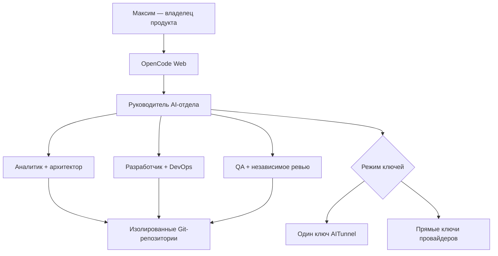

# AI Orchestra — виртуальный отдел разработки и аналитики

Пилотный контур, который превращает один AI-интерфейс в управляемую команду: руководитель отдела принимает задачу, подключает аналитика и архитектора, передает реализацию разработчику, затем отправляет результат в QA и независимое ревью.

На старте все модели работают через один ключ AITunnel. Когда появятся прямые договоры или ключи провайдеров, контур переключается на OpenAI + Anthropic + Google одной командой — без переноса репозиториев, истории и правил работы.

> Статус: пилот. Контур уже способен работать с кодом и тестами, но публикация веток, merge и production deploy оставлены под ручным подтверждением владельца.

## Что входит

| Роль | Зона ответственности | Доступ к изменениям |
| --- | --- | --- |
| `department-lead` | Прием задачи, декомпозиция, делегирование, контроль результата | Только управление агентами |
| `business-analyst` | Требования, сценарии, критерии приемки | Только чтение |
| `architect` | Архитектура, API, БД, риски, откат | Только чтение |
| `developer` | Реализация и локальные проверки | Редактирование, безопасные команды |
| `qa-engineer` | Тесты и воспроизводимые дефекты | Только чтение и запуск проверок |
| `code-reviewer` | Независимое ревью diff | Только чтение |
| `devops-engineer` | Docker, CI/CD, миграции, runbook | Редактирование, без production deploy |
| `data-analyst` | SQL, качество данных, метрики и аналитическая логика | Чтение, ограниченные вычисления |

## Архитектура пилота



Контейнер не получает Docker socket хоста и не может самовольно управлять действующими production-контейнерами. Порт OpenCode публикуется только на `127.0.0.1`; наружный доступ следует давать через Nginx и HTTPS.

## Режимы ключей

### `shared` — временный общий ключ

- один `AITUNNEL_API_KEY`;
- модели разных производителей доступны через OpenAI-совместимый endpoint AITunnel;
- удобно для пилота, оплаты в рублях и быстрого сравнения моделей;
- для ключа рекомендуется установить бюджет, срок действия, список разрешенных моделей и IP сервера.

### `separate` — прямые ключи

- `OPENAI_API_KEY` для архитектуры и coding-задач;
- `ANTHROPIC_API_KEY` для руководителя и code review;
- `GOOGLE_GENERATIVE_AI_API_KEY` для бизнес- и data-аналитики;
- AITunnel исключается из рабочего маршрута, остальные компоненты остаются прежними.

Переключение:

```bash
make shared
make separate
```

Команда атомарно заменяет активный конфиг и, если сервис уже работает, пересоздает только контейнер OpenCode. Репозитории и сохраненные сессии находятся в отдельных volumes и не затрагиваются.

## Требования к серверу

Минимум для пилота:

- Ubuntu 22.04/24.04;
- 4 vCPU;
- 8 ГБ RAM;
- 30–50 ГБ свободного диска плюс место под рабочие репозитории;
- Docker Engine и Docker Compose v2;
- Nginx и TLS для внешнего доступа.

GPU не требуется: модели работают в облаке. Наш текущий сервер можно использовать, если перед запуском проверить запас RAM/CPU и не пересекать порты с действующими сервисами Arvento, Traccar и Metabase.

## Быстрый запуск

```bash
cd /opt
git clone https://github.com/m9117882424/ai_orchestra.git
cd ai_orchestra

make init
nano .env
```

Для первого запуска заполните в `.env` только:

```dotenv
KEY_MODE=shared
AITUNNEL_API_KEY=sk-aitunnel-...
```

Пароль веб-интерфейса автоматически генерируется командой `make init`. Не публикуйте `.env` и не отправляйте его в чат.

Проверка и запуск:

```bash
make shared
make preflight
make build
make up
make status
make smoke
```

Логи:

```bash
make logs
```

Локальный интерфейс будет доступен на `http://127.0.0.1:4096`. Для доступа из браузера настройте Nginx по примеру `deploy/nginx-ai-department.conf.example` и замените домен/пути сертификатов.

## Добавление рабочего проекта

Все проекты находятся в каталоге `repos/`, который монтируется внутрь контейнера как `/workspace/repos/projects`.

Пример:

```bash
cd /opt/ai_orchestra/repos
git clone https://github.com/m9117882424/arvento-kpp-report.git
```

Для приватного репозитория используйте отдельный deploy key или fine-grained GitHub token только с необходимыми правами. Не вставляйте токен в URL, который попадет в историю shell.

После клонирования откройте OpenCode Web, выберите проект и агента `department-lead`, затем сформулируйте задачу обычным языком. Пример:

> В проекте Arvento нужно изменить расчет пробега: исключить дребезг координат на стоянке. Сначала проанализируй текущую логику и тесты, затем предложи критерии приемки. После согласования реализуй, запусти проверки и проведи независимое ревью. Не выполняй deploy и git push.

## Переход на раздельные ключи

1. Заполните в `.env`:

```dotenv
OPENAI_API_KEY=...
ANTHROPIC_API_KEY=...
GOOGLE_GENERATIVE_AI_API_KEY=...
GEMINI_API_KEY=...
```

2. Проверьте актуальные ID моделей:

```bash
docker compose exec opencode opencode models --refresh
```

3. При необходимости обновите модели в `config/opencode.separate.json`.

4. Переключите маршрут:

```bash
make separate
make preflight
make status
```

Возврат к AITunnel:

```bash
make shared
```

## Безопасная эксплуатация

- Репозиторий публичный, поэтому здесь нет и не должно быть реальных ключей.
- У AITunnel создайте отдельный ключ для этого контура, ограничьте бюджет и разрешенные модели.
- Не публикуйте порт `4096` на `0.0.0.0`; Docker Compose намеренно привязывает его к localhost.
- Перед подключением каждого проекта проверьте его `AGENTS.md` и список разрешенных команд.
- Не монтируйте `/var/run/docker.sock`: это практически root-доступ к серверу в красивой упаковке.
- Production deploy, миграции, merge и push должны выполняться отдельным подтвержденным процессом.
- Для каждого production-проекта используйте отдельный worktree/ветку и резервную копию БД перед миграциями.

## Где хранится память

На пилоте память разделена на два уровня:

- Git и файлы проекта — источник истины по коду, решениям и документации;
- `data/opencode` и `data/state` — история сессий OpenCode, состояние и локальный контекст.

Эти каталоги не попадают в Git. Их нужно включить в серверное резервное копирование.

PostgreSQL + pgvector пока намеренно не добавлены: сначала надо проверить рабочий процесс и качество ролей. На втором этапе общая семантическая память подключается как отдельный MCP-сервис с правилами хранения, сроками жизни и разграничением по проектам. Иначе мы быстро построим дорогую корпоративную память, которая уверенно помнит вчерашние ошибки.

## План развития

1. Пилот на одном-двух непроизводственных репозиториях через AITunnel.
2. Настройка лимитов, журналов расходов и эталонных задач для сравнения моделей.
3. Подключение GitHub App: ветка → проверки → draft PR, без автослияния.
4. Общая память PostgreSQL/pgvector с изоляцией проектов.
5. Отдельные ключи провайдеров и автоматический fallback.
6. Подключение Telegram/корпоративного портала как входящего канала задач.
7. Только после стабильного пилота — контролируемый staging deploy.

## Диагностика

```bash
docker compose ps
docker compose logs --tail=200 opencode
curl -u "opencode:ПАРОЛЬ" http://127.0.0.1:4096/global/health
```

Проверка AITunnel без запуска отдела:

```bash
set -a
source .env
set +a
python3 scripts/aitunnel_smoke_test.py --dry-run
python3 scripts/aitunnel_smoke_test.py --model gpt-4o-mini
```

Полный тест structured output, tool calling, streaming и Responses API выполняет платные запросы:

```bash
python3 scripts/aitunnel_smoke_test.py --full --model gpt-4o-mini
```

## Остановка и обновление

Остановка без удаления данных:

```bash
make down
```

Обновление:

```bash
git pull --ff-only
make preflight
make build
make up
```

Резервировать нужно `.env` отдельно в защищенном хранилище, а также каталоги `repos/`, `data/opencode/` и `data/state/`.

